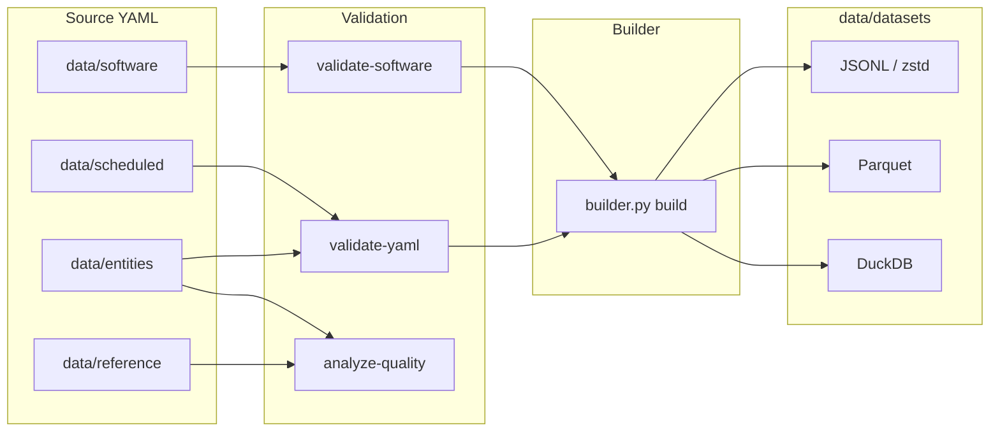

# Architecture

## Layers

1. **Source YAML** — one file per catalog or software definition. Edit these; never hand-edit `data/datasets/`.
2. **Reference vocabularies** — allowed values under `data/reference/` (owner types, catalog types, software IDs, access modes, status).
3. **Validation** — Cerberus schema (`data/schemes/catalog.json`), JSON Schema (`catalog.schema.json`), and quality rules.
4. **Build** — flattens YAML into JSONL, compresses with zstd, writes Parquet and DuckDB.
5. **Consumers** — DuckDB/Parquet preferred; JSONL for line-oriented tools; YAML only when authoring.

## Enrichment and monitoring

| Pipeline | Script / workflow | Output |
|----------|-------------------|--------|
| Re3Data metadata | `scripts/re3data_enrichment.py` | `_re3data` on matching entities |
| CKAN ecosystem sync | `scripts/sync_ckan_ecosystem.py` | new scheduled or entity YAML |
| Quality analysis | `python scripts/builder.py analyze-quality` | `dataquality/` |
| URL liveness | `.github/workflows/liveness.yml` | `dataquality/liveness_report.jsonl` |
| Integrity regression | `tests/test_quality_regression.py` | fails CI if CRITICAL/IMPORTANT counts grow |

## Scope boundary

In-scope: YAML records, schema/validation, enrichment, quality analysis, dataset exports.

Out-of-scope: production query APIs and MCP servers.

## Related

- [directory-layout.md](directory-layout.md)
- [discovery.md](discovery.md)
- [exports.md](exports.md)
- [cli.md](cli.md)
- [metadata-quality.md](metadata-quality.md)
