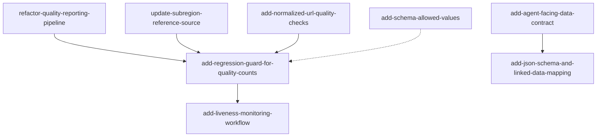

# OpenSpec Roadmap (Genspark Audit Backlog)

Source: [dev/docs/genspark_report_20260616.md](../dev/docs/genspark_report_20260616.md)

This document maps audit recommendations to OpenSpec change proposals, records dependencies, and defines acceptance criteria. Implementation follows the OpenSpec workflow in [openspec/AGENTS.md](AGENTS.md).

## Existing OpenSpec Changes (do not duplicate)

| Change ID | Status | Genspark overlap | Notes |
|-----------|--------|------------------|-------|
| `add-schema-allowed-values` | In progress (3/5 tasks) | Enum validation for `catalog_type`, `status`, `access_mode` | Finish verification tasks; do not create a new enum-validation change |
| `update-apidetect-reliability` | Complete | Endpoint detection reliability | Orthogonal to liveness monitoring; liveness is a separate scheduled probe |
| `add-ckan-ecosystem-sync` | Complete | Catalog discovery automation | Orthogonal to API/MCP surface |

## Genspark → OpenSpec Mapping

| Genspark priority | Recommendation | OpenSpec change ID | Wave |
|-------------------|----------------|-------------------|------|
| Critical | Fix quality reporter aggregation | `refactor-quality-reporting-pipeline` | 1 |
| Critical | Register subregion check / remove deprecated stubs | `refactor-quality-reporting-pipeline` | 1 |
| Critical | Replace IP2Location ISO-3166-2 reference | `update-subregion-reference-source` | 1 |
| Critical | JSON Schema + field descriptions | `add-json-schema-and-linked-data-mapping` | 4 |
| Critical | Fix broken README link | `add-agent-facing-data-contract` | 3 |
| Important | Read-only HTTP API + MCP server | Deferred (separate repositories) | — |
| Important | JSON-LD @context (DCAT/schema.org) | `add-json-schema-and-linked-data-mapping` | 4 |
| Important | Scheduled HTTP liveness CI | `add-liveness-monitoring-workflow` | 2 |
| Important | DATASHEET, CITATION.cff, Zenodo DOI | `add-agent-facing-data-contract` | 3 |
| Important | Enum validation (reference YAML) | `add-schema-allowed-values` (existing) | — |
| Medium | Normalized-URL duplicate detection | `add-normalized-url-quality-checks` | 1 |
| Medium | llms.txt, SECURITY.md, templates | `add-agent-facing-data-contract` | 3 |
| Low | CI guard for quality regression | `add-regression-guard-for-quality-counts` | 1 |
| Low | Per-record license (`rights.license`) | Deferred (future change) | — |
| Low | Rename `_re3data` → `enrichments.re3data` | Deferred (breaking; future change) | — |
| Medium | AI description backfill (`enrich_ai.py`) | Deferred (future change) | — |
| Medium | Per-record embeddings column | Deferred (future change) | — |

Deferred items are out of scope for this backlog batch but noted for a follow-up wave.

## Execution Order and Dependencies

### Wave 1 — Quality foundation (PRs 1–4)

1. `refactor-quality-reporting-pipeline` — no dependencies
2. `update-subregion-reference-source` — no dependencies (can run parallel to 1)
3. `add-normalized-url-quality-checks` — benefits from 1 (consistent reporting)
4. `add-regression-guard-for-quality-counts` — depends on 1–3 (stable baseline counts)

### Wave 2 — Operational monitoring

5. `add-liveness-monitoring-workflow` — depends on stable quality baseline (wave 1)

### Wave 3 — Docs and governance

6. `add-agent-facing-data-contract` — no hard dependencies; can start after wave 1

### Wave 4 — Interoperability

7. `add-json-schema-and-linked-data-mapping` — benefits from agent docs (wave 3)

## Acceptance Criteria (per change)

Every change in this backlog MUST satisfy:

1. `proposal.md`, `tasks.md`, and at least one delta spec under `specs/<capability>/spec.md`
2. `design.md` present only when cross-cutting decisions are required
3. `openspec validate <change-id> --strict` passes
4. No overlap with active changes listed above (extend existing changes instead)
5. Each requirement in delta specs has at least one `#### Scenario:` block

## Change Index

| Change ID | Capability | Design doc |
|-----------|------------|------------|
| [refactor-quality-reporting-pipeline](changes/refactor-quality-reporting-pipeline/proposal.md) | `data-quality-reporting` | No |
| [update-subregion-reference-source](changes/update-subregion-reference-source/proposal.md) | `subregion-validation` | Yes |
| [add-normalized-url-quality-checks](changes/add-normalized-url-quality-checks/proposal.md) | `url-quality-checks` | No |
| [add-regression-guard-for-quality-counts](changes/add-regression-guard-for-quality-counts/proposal.md) | `quality-regression-guard` | No |
| [add-liveness-monitoring-workflow](changes/add-liveness-monitoring-workflow/proposal.md) | `catalog-liveness` | Yes |
| [add-agent-facing-data-contract](changes/add-agent-facing-data-contract/proposal.md) | `agent-documentation` | No |
| [add-json-schema-and-linked-data-mapping](changes/add-json-schema-and-linked-data-mapping/proposal.md) | `catalog-interoperability` | Yes |
