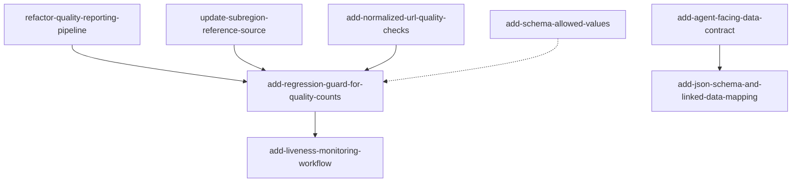

# OpenSpec Roadmap (Genspark Audit Backlog)

Source: [dev/docs/genspark_report_20260616.md](../dev/docs/genspark_report_20260616.md)

This document maps audit recommendations to OpenSpec change proposals. Implementation follows [openspec/AGENTS.md](AGENTS.md).

**Status (21 August 2026):** Completed Genspark-wave changes were archived under `openspec/changes/archive/2026-08-21-*`. Three folders remain active because their task lists are not fully checked.

Deferred on purpose: production HTTP API / MCP (other repositories), per-record license, `_re3data` rename, AI description backfill, embeddings, Zenodo DOI.

## Remaining active changes

| Change ID | Status | Notes |
|-----------|--------|-------|
| `add-schema-allowed-values` | 3/5 tasks | Schema `allowed` lists exist; verification tasks 2.1–2.2 still open |
| `refactor-quality-reporting-pipeline` | 10/11 tasks | Remaining pytest cleanup in unrelated tests |
| `add-normalized-url-quality-checks` | 10/12 tasks | Duplicate URL detection; finish leftover tasks before archive |

## Genspark → OpenSpec Mapping

| Genspark priority | Recommendation | OpenSpec change ID | Wave |
|-------------------|----------------|-------------------|------|
| Critical | Fix quality reporter aggregation | `refactor-quality-reporting-pipeline` | 1 |
| Critical | Register subregion check / remove deprecated stubs | `refactor-quality-reporting-pipeline` | 1 |
| Critical | Replace IP2Location ISO-3166-2 reference | `update-subregion-reference-source` | 1 |
| Critical | JSON Schema + field descriptions | `add-json-schema-and-linked-data-mapping` | 4 |
| Critical | Fix broken README link | `add-agent-facing-data-contract` | 3 |
| Important | Read-only HTTP API + MCP server | Deferred (separate repositories) | — |
| Important | JSON-LD @context (DCAT/schema.org) | `add-json-schema-and-linked-data-mapping` | 4 |
| Important | Scheduled HTTP liveness CI | `add-liveness-monitoring-workflow` | 2 |
| Important | DATASHEET, CITATION.cff, Zenodo DOI | `add-agent-facing-data-contract` | 3 |
| Important | Enum validation (reference YAML) | `add-schema-allowed-values` (existing) | — |
| Medium | Normalized-URL duplicate detection | `add-normalized-url-quality-checks` | 1 |
| Medium | llms.txt, SECURITY.md, templates | `add-agent-facing-data-contract` | 3 |
| Low | CI guard for quality regression | `add-regression-guard-for-quality-counts` | 1 |
| Low | Per-record license (`rights.license`) | Deferred (future change) | — |
| Low | Rename `_re3data` → `enrichments.re3data` | Deferred (breaking; future change) | — |
| Medium | AI description backfill (`enrich_ai.py`) | Deferred (future change) | — |
| Medium | Per-record embeddings column | Deferred (future change) | — |

Deferred items are out of scope for this backlog batch but noted for a follow-up wave.

## Execution Order and Dependencies

```mermaid
flowchart TD
    W1A[refactor-quality-reporting-pipeline]
    W1B[update-subregion-reference-source]
    W1C[add-normalized-url-quality-checks]
    W1D[add-regression-guard-for-quality-counts]
    W2A[add-liveness-monitoring-workflow]
    W3A[add-agent-facing-data-contract]
    W4A[add-json-schema-and-linked-data-mapping]
    EXISTING[add-schema-allowed-values]

    W1A --> W1D
    W1B --> W1D
    W1C --> W1D
    W1D --> W2A
    W3A --> W4A
    EXISTING -.-> W1D
```

### Wave 1 — Quality foundation (PRs 1–4)

1. `refactor-quality-reporting-pipeline` — no dependencies
2. `update-subregion-reference-source` — no dependencies (can run parallel to 1)
3. `add-normalized-url-quality-checks` — benefits from 1 (consistent reporting)
4. `add-regression-guard-for-quality-counts` — depends on 1–3 (stable baseline counts)

### Wave 2 — Operational monitoring

5. `add-liveness-monitoring-workflow` — depends on stable quality baseline (wave 1)

### Wave 3 — Docs and governance

6. `add-agent-facing-data-contract` — no hard dependencies; can start after wave 1

### Wave 4 — Interoperability

7. `add-json-schema-and-linked-data-mapping` — benefits from agent docs (wave 3)

## Acceptance Criteria (per change)

Every change in this backlog MUST satisfy:

1. `proposal.md`, `tasks.md`, and at least one delta spec under `specs/<capability>/spec.md`
2. `design.md` present only when cross-cutting decisions are required
3. `openspec validate <change-id> --strict` passes
4. No overlap with active changes listed above (extend existing changes instead)
5. Each requirement in delta specs has at least one `#### Scenario:` block

## Change Index

Active (not archived):

| Change ID | Capability |
|-----------|------------|
| [refactor-quality-reporting-pipeline](changes/refactor-quality-reporting-pipeline/proposal.md) | `data-quality-reporting` |
| [add-normalized-url-quality-checks](changes/add-normalized-url-quality-checks/proposal.md) | `url-quality-checks` |
| [add-schema-allowed-values](changes/add-schema-allowed-values/proposal.md) | schema enums |

Archived 21 August 2026 under `openspec/changes/archive/2026-08-21-*`. Current specs: `openspec/specs/`.
